# PolicyChecker

**PolicyChecker** is a decision engine and workflow platform for evaluating business requests (e.g. SaaS purchases, vendor onboarding) against organizational policies. It supports automated compliance checks, risk assessment, manual review, and an immutable audit trail.

## Key Features

- **Rule engine** — versioned policies with a visual rule builder (conditions and effects)
- **Automated decisions** — approve, reject, or route for review based on budget, vendor risk, GDPR/DPA, and more
- **RBAC** — Requester, Reviewer, Policy Owner, Policy Approver, Auditor, and Admin roles
- **Audit trail** — immutable logs for requests, evaluations, and manual overrides
- **Multi-currency** — costs normalized to EUR for consistent policy evaluation

## Technology Stack

- **App:** Next.js 15 (App Router), React, Tailwind CSS
- **API / server logic:** Next.js Server Actions
- **Database:** PostgreSQL, Prisma ORM
- **Runtime:** Docker Compose (Node.js 20 + PostgreSQL 15)
- **Tests:** Vitest (unit), Playwright (screenshots)

## Requirements

- [Docker Desktop](https://www.docker.com/products/docker-desktop/) (Docker Compose v2)
- Free host port **3000** (application)
- Free host port **5432** (PostgreSQL), unless you change port mapping in `docker-compose.yml`

No local Node.js or PostgreSQL installation is required.

## Installation & Setup

Run all commands from the **repository root** (`PolicyChecker/`), not from `web/`.

### 1. Clone the repository

```bash
git clone <repository_url>
cd PolicyChecker
```

### 2. Start the application

```bash
docker compose up --build
```

> **Fresh clone / new machine:** The first start runs `npm install` inside the container (may take **3–5 minutes**). Do not open the browser until you see `Ready on http://0.0.0.0:3000` in the logs. If you only cloned the repo without `web/docker-entrypoint.sh`, pull the latest code first (`git pull`).

On first run, Docker will pull images, install dependencies, apply migrations, and seed the database. Wait until you see:

```
app-1  | No pending migrations to apply.
app-1  | Seeding complete.
app-1  | > Ready on http://0.0.0.0:3000 (Custom Server)
```

### 3. Open the app

In your browser: **http://localhost:3000**

### 4. Sign in

All test accounts use the password **`test1234`**:

| Email | Role |
|-------|------|
| `requester@pc.com` | Requester |
| `reviewer@pc.com` | Reviewer |
| `owner@pc.com` | Policy Owner |
| `approver@pc.com` | Policy Approver |
| `auditor@pc.com` | Auditor |
| `admin@pc.com` | Admin |

### Stop the application

Press `Ctrl+C`, then optionally:

```bash
docker compose down
```

To remove database data as well:

```bash
docker compose down -v
```

## Useful commands

```bash
# Run in the background
docker compose up -d

# View application logs
docker compose logs app -f

# Run unit tests inside the container
docker compose exec app npm test

# Regenerate screenshots (app must be running)
cd web && npm run screenshots:docker
```

## Troubleshooting

| Issue | What to do |
|-------|------------|
| Prompt to install `prisma@7.x` | Run from repo root after `git pull`; entrypoint runs `npm install` first so the project uses Prisma 5.x from `package.json` |
| Page does not load | Check `docker compose logs app` and wait for `Ready on http://0.0.0.0:3000` (first start may take a few minutes while `npm install` runs) |
| `Can't reach database server at db:5432` | Run `docker compose down`, then `docker compose up` again (DB healthcheck + retries are configured) |
| Port 3000 already in use | Change the mapping in `docker-compose.yml` (e.g. `"3001:3000"`) and open `http://localhost:3001` |
| `docker compose` fails from `web/` | Run it from the repository root (`PolicyChecker/`) |
| Access from another device on the LAN | Use `http://<host-machine-ip>:3000`, not `localhost` |

## Gallery

Visual overview of main screens (see `screenshots/` for the full set):

### Dashboards & authentication

| Login | Requester dashboard | Reviewer dashboard | Admin dashboard |
|:---:|:---:|:---:|:---:|
|  |  | 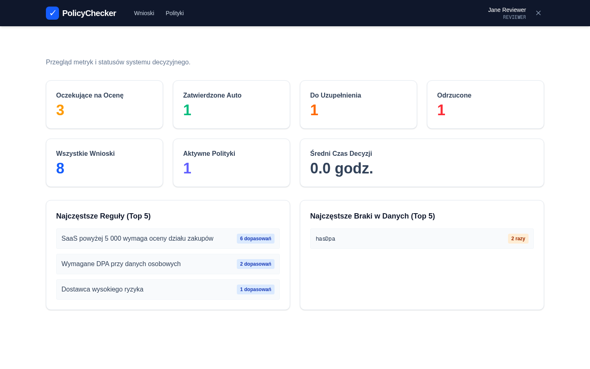 | 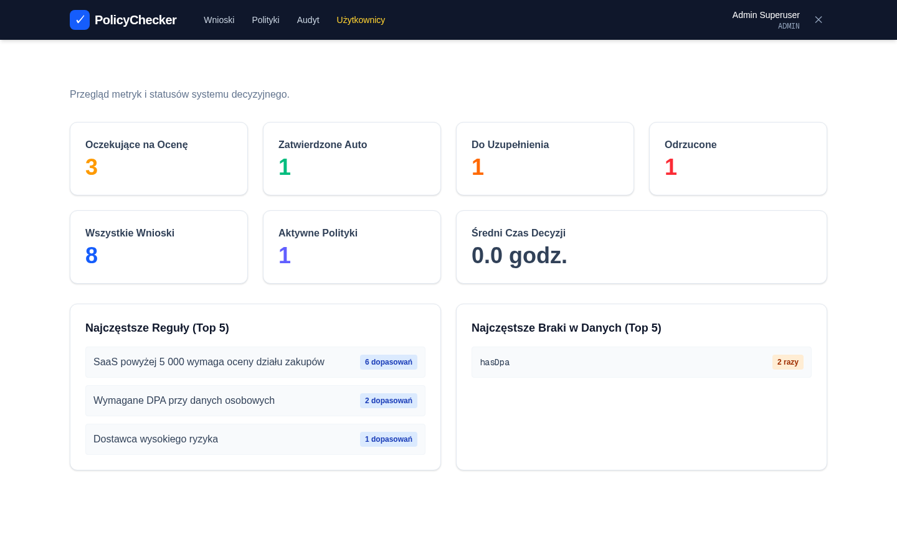 |

### Request workflow

| New request | Requests list | Request details | Policy evaluation panel |
|:---:|:---:|:---:|:---:|
| 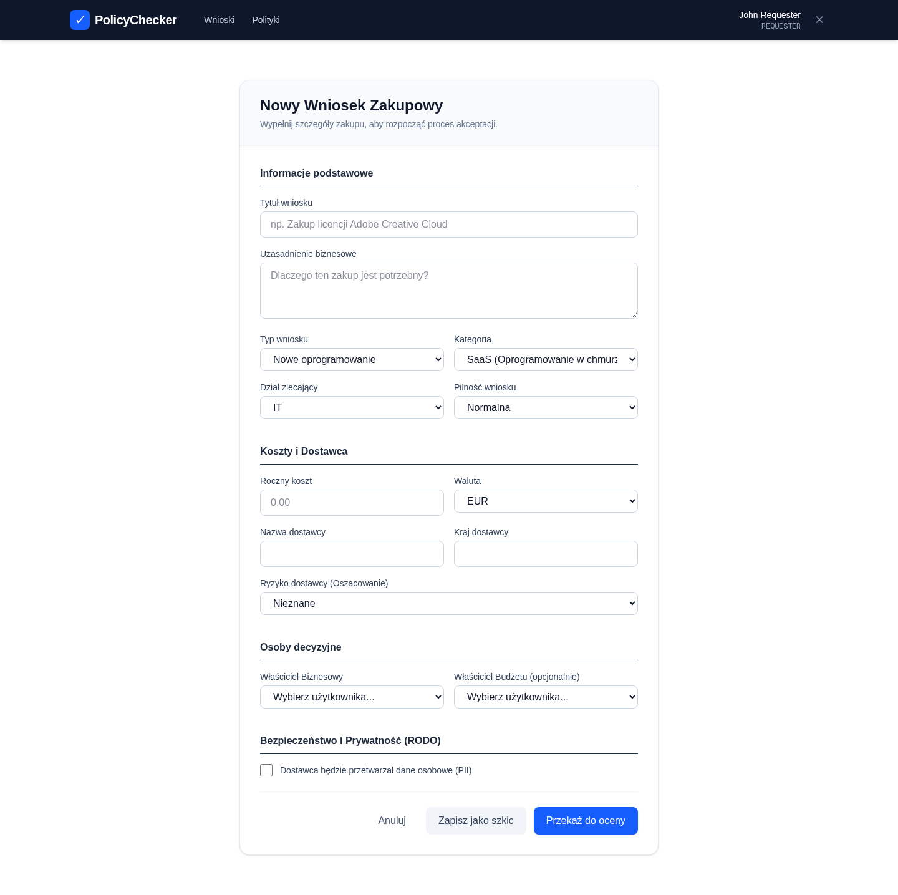 | 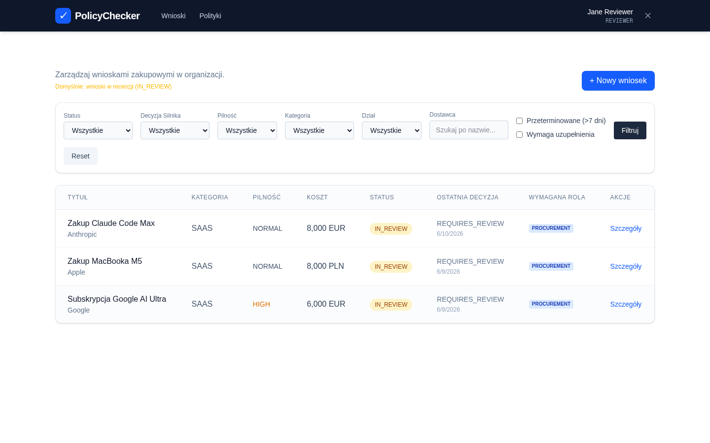 | 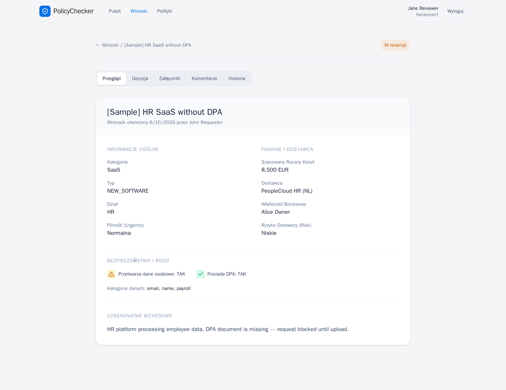 | 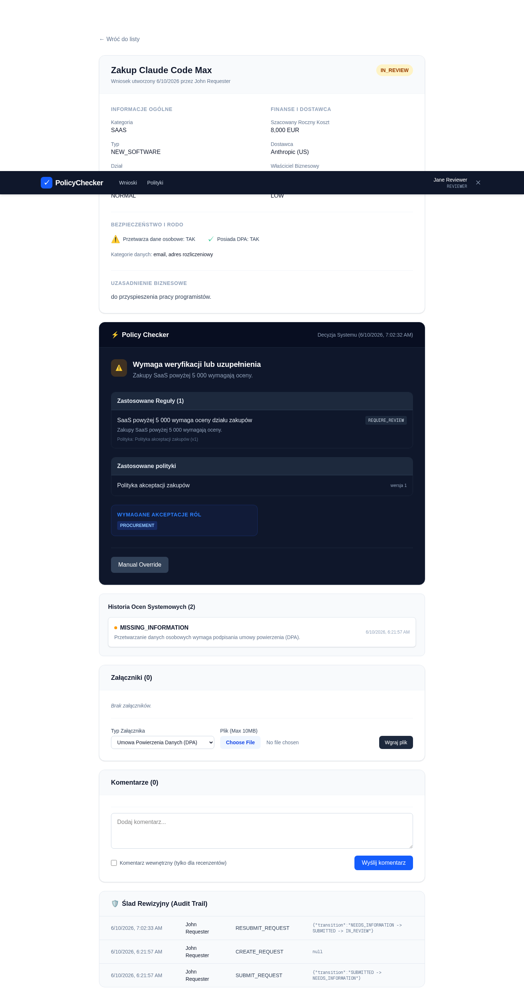 |

### Decisions & overrides

| Needs information | Auto-approved | Rejected | Manual override |
|:---:|:---:|:---:|:---:|
| 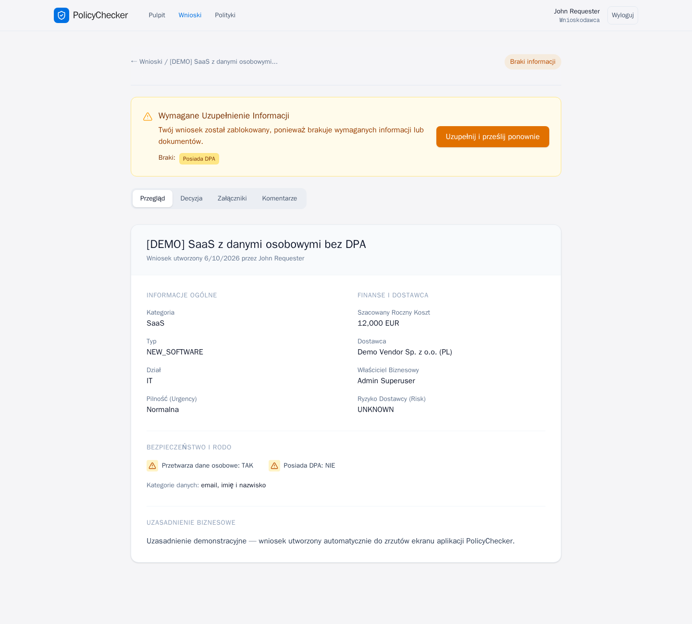 | 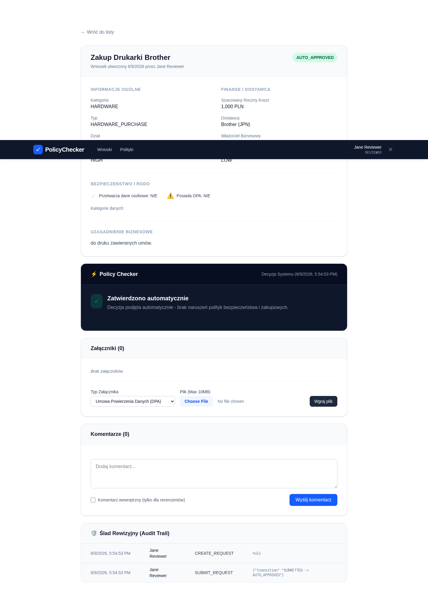 | 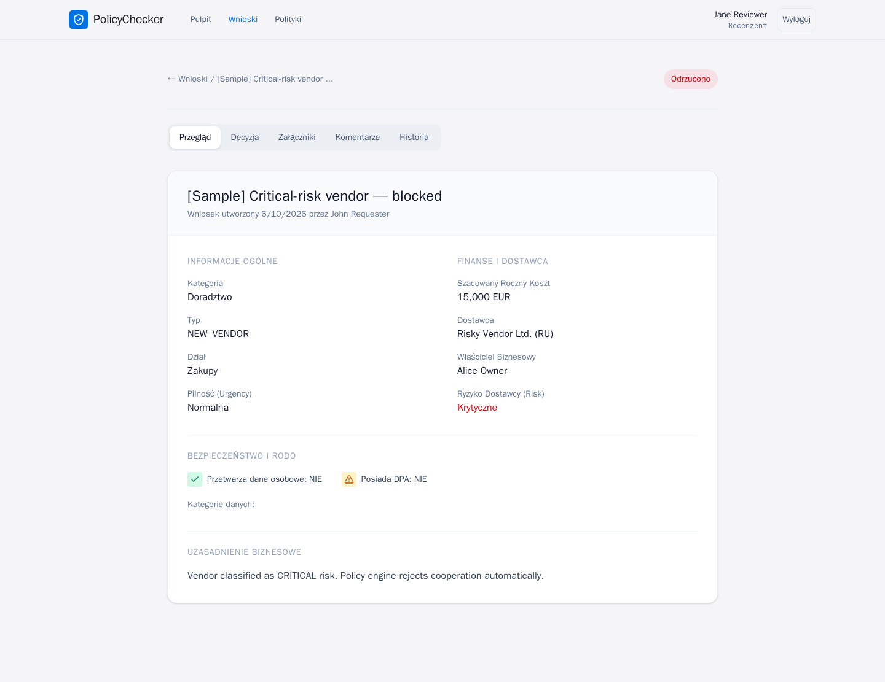 | 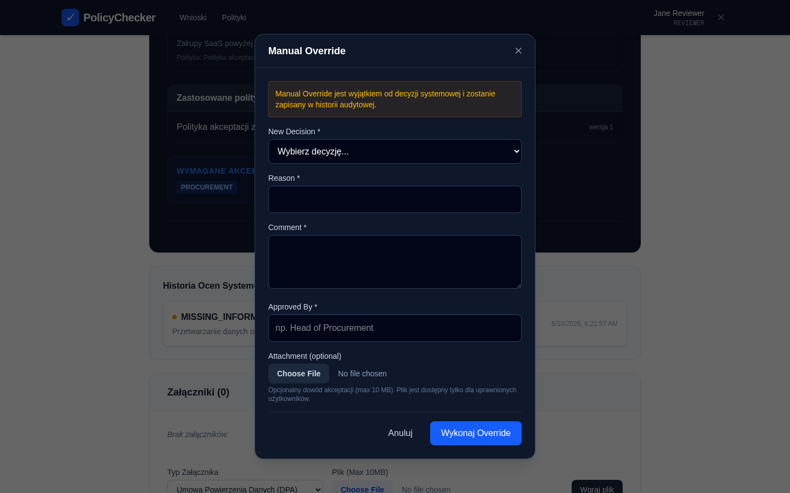 |

### Policies & audit

| Policies | Rule builder | Test console | Audit trail |
|:---:|:---:|:---:|:---:|
| 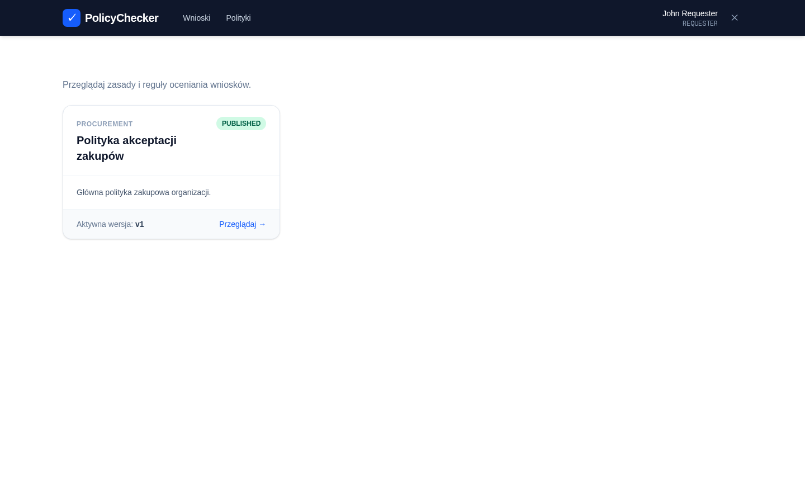 | 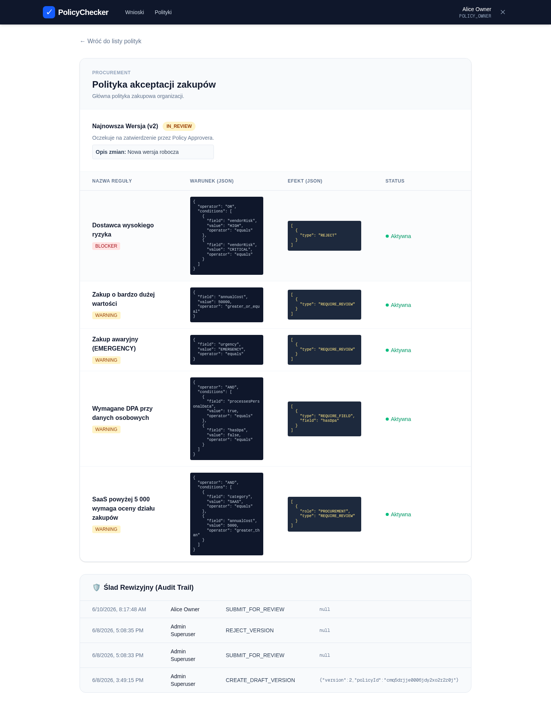 | 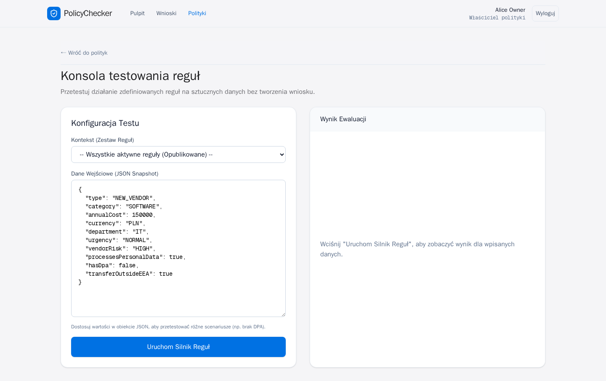 | 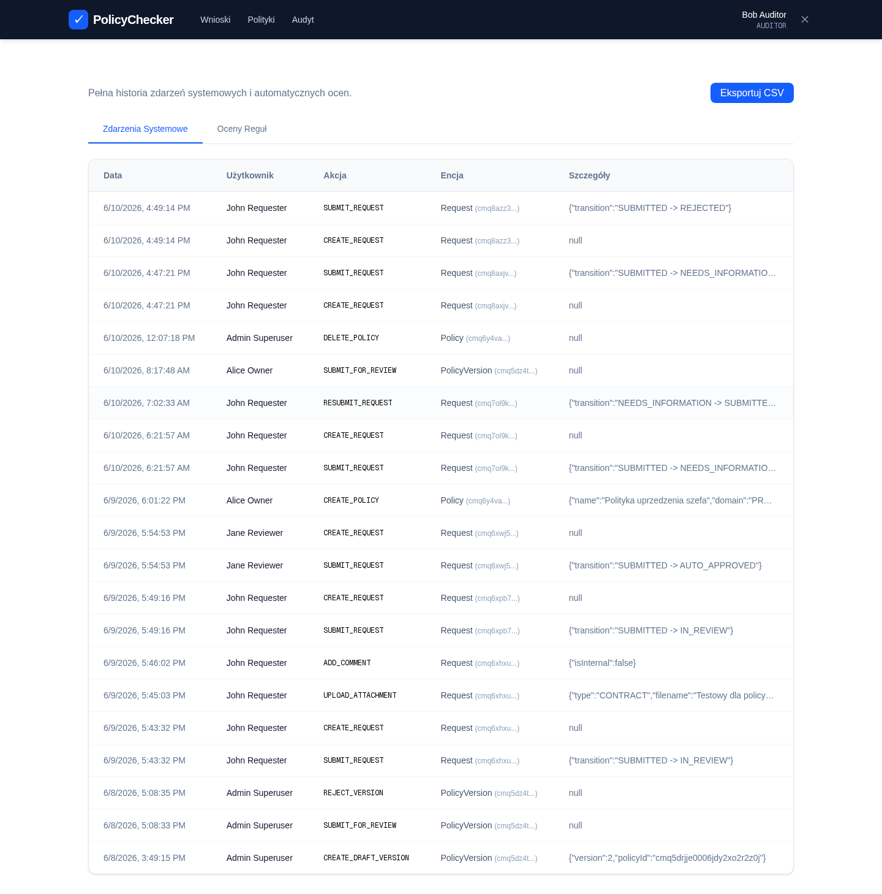 |

---

Screenshots are generated with Playwright (`web/scripts/capture-screenshots.mjs`).
